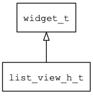

## list\_view\_h\_t
### 概述


水平列表视图控件。

list\_view\_h\_t是[widget\_t](widget_t.md)的子类控件，widget\_t的函数均适用于list\_view\_h\_t控件。

在xml中使用"list\_view\_h"标签创建水平列表视图控件。如：

```xml
<list_view_h x="center"  y="10" w="90%" h="100" item_width="200" spacing="5">
<scroll_view name="view" w="100%" h="100%">
<image style="border" draw_type="auto" image="1" text="1"/>
...
</scroll_view>
</list_view_h>
```

> 注意：列表项不是作为列表视图控件的直接子控件，而是作为滚动视图的子控件。


> 更多用法请参考：[list\_view\_h.xml](
https://github.com/zlgopen/awtk/blob/master/demos/assets/default/raw/ui/list_view_h.xml)

在c代码中使用函数list\_view\_h\_create创建水平列表视图控件。如：

```c
widget_t* list_view = list_view_h_create(win, 0, 0, 0, 0);
```

用代码构造列表视图是比较繁琐的事情，最好用XML来构造。
如果需要动态修改，可以使用widget\_clone来增加列表项，使用widget\_remove\_child来移出列表项。

可用通过style来设置控件的显示风格，如背景颜色和边框颜色等(一般情况不需要)。
----------------------------------
### 函数
<p id="list_view_h_t_methods">

| 函数名称 | 说明 | 
| -------- | ------------ | 
| <a href="#list_view_h_t_list_view_h_cast">list\_view\_h\_cast</a> | 转换为list_view_h对象(供脚本语言使用)。 |
| <a href="#list_view_h_t_list_view_h_create">list\_view\_h\_create</a> | 创建list_view_h对象 |
| <a href="#list_view_h_t_list_view_h_set_item_width">list\_view\_h\_set\_item\_width</a> | 设置列表项的宽度。 |
| <a href="#list_view_h_t_list_view_h_set_spacing">list\_view\_h\_set\_spacing</a> | 设置列表项的间距。 |
### 属性
<p id="list_view_h_t_properties">

| 属性名称 | 类型 | 说明 | 
| -------- | ----- | ------------ | 
| <a href="#list_view_h_t_item_width">item\_width</a> | int32\_t | 列表项的宽度。 |
| <a href="#list_view_h_t_spacing">spacing</a> | int32\_t | 间距。 |
#### list\_view\_h\_cast 函数
-----------------------

* 函数功能：

> <p id="list_view_h_t_list_view_h_cast">转换为list_view_h对象(供脚本语言使用)。

* 函数原型：

```
widget_t* list_view_h_cast (widget_t* widget);
```

* 参数说明：

| 参数 | 类型 | 说明 |
| -------- | ----- | --------- |
| 返回值 | widget\_t* | list\_view\_h对象。 |
| widget | widget\_t* | list\_view\_h对象。 |
#### list\_view\_h\_create 函数
-----------------------

* 函数功能：

> <p id="list_view_h_t_list_view_h_create">创建list_view_h对象

* 函数原型：

```
widget_t* list_view_h_create (widget_t* parent, xy_t x, xy_t y, wh_t w, wh_t h);
```

* 参数说明：

| 参数 | 类型 | 说明 |
| -------- | ----- | --------- |
| 返回值 | widget\_t* | 对象。 |
| parent | widget\_t* | 父控件 |
| x | xy\_t | x坐标 |
| y | xy\_t | y坐标 |
| w | wh\_t | 宽度 |
| h | wh\_t | 高度 |
#### list\_view\_h\_set\_item\_width 函数
-----------------------

* 函数功能：

> <p id="list_view_h_t_list_view_h_set_item_width">设置列表项的宽度。

* 函数原型：

```
ret_t list_view_h_set_item_width (widget_t* widget, int32_t item_width);
```

* 参数说明：

| 参数 | 类型 | 说明 |
| -------- | ----- | --------- |
| 返回值 | ret\_t | 返回RET\_OK表示成功，否则表示失败。 |
| widget | widget\_t* | 控件对象。 |
| item\_width | int32\_t | 列表项的宽度。 |
#### list\_view\_h\_set\_spacing 函数
-----------------------

* 函数功能：

> <p id="list_view_h_t_list_view_h_set_spacing">设置列表项的间距。

* 函数原型：

```
ret_t list_view_h_set_spacing (widget_t* widget, int32_t spacing);
```

* 参数说明：

| 参数 | 类型 | 说明 |
| -------- | ----- | --------- |
| 返回值 | ret\_t | 返回RET\_OK表示成功，否则表示失败。 |
| widget | widget\_t* | 控件对象。 |
| spacing | int32\_t | 列表项的间距。 |
#### item\_width 属性
-----------------------
> <p id="list_view_h_t_item_width">列表项的宽度。

* 类型：int32\_t

| 特性 | 是否支持 |
| -------- | ----- |
| 可直接读取 | 是 |
| 可直接修改 | 否 |
| 可持久化   | 是 |
| 可脚本化   | 是 |
| 可在IDE中设置 | 是 |
| 可在XML中设置 | 是 |
| 可通过widget\_get\_prop读取 | 是 |
| 可通过widget\_set\_prop修改 | 是 |
#### spacing 属性
-----------------------
> <p id="list_view_h_t_spacing">间距。

* 类型：int32\_t

| 特性 | 是否支持 |
| -------- | ----- |
| 可直接读取 | 是 |
| 可直接修改 | 否 |
| 可持久化   | 是 |
| 可脚本化   | 是 |
| 可在IDE中设置 | 是 |
| 可在XML中设置 | 是 |
| 可通过widget\_get\_prop读取 | 是 |
| 可通过widget\_set\_prop修改 | 是 |
